# Universidad Técnica de Ambato
# Facultad de Ingeniería en Sistemas, Electrónica e Industrial

## Proyecto: Gestión de Estructuras de Datos mediante Árboles Binarios de Búsqueda
**Asignatura:** Estructura de Datos  
**Lenguajes de Programación:** C++  
**Estudiante:** Toapanta Paucar Pablo Daniel

---

## 1. Introducción
El presente proyecto consiste en el diseño e implementación de un sistema académico de gestión de estudiantes utilizando la estructura de datos de Árbol Binario de Búsqueda (BST). La solución ha sido desarrollada de forma bilingüe en los lenguajes C++ y Java, aplicando principios de programación orientada a objetos, recursividad y gestión eficiente de memoria.

El sistema permite organizar la información estudiantil (cédula, nombres, notas, carrera y nivel) tomando como clave primaria la cédula de identidad, garantizando un acceso logarítmico a la información.

## 2. Características Técnicas
### Implementación en C++
- Uso de punteros para la gestión de nodos.
- Implementación de memoria dinámica para la creación y eliminación de registros.
- Modularización mediante estructuras y clases.

## 3. Funcionalidades del Sistema
El software incluye las siguientes capacidades obligatorias:
- Inserción y eliminación de nodos (estudiantes).
- Búsqueda binaria por número de cédula.
- Recorridos de profundidad (Inorden, Preorden, Postorden).
- Recorrido en anchura (Por niveles/BFS).
- Cálculos estructurales: altura del árbol y conteo total de nodos.
- Filtros de rendimiento académico: identificación de notas máximas, mínimas, estudiantes aprobados y reprobados.

## 4. Instrucciones de Ejecución

### Entorno C++
1. Compilar el archivo principal: `g++ -o sistema_academico main.cpp`
2. Ejecutar el binario generado: `./sistema_academico`

---

## 5. Evidencias de Ejecución

A continuación se presentan las capturas de pantalla que validan el correcto funcionamiento de cada módulo del sistema:

### Gestión de Datos y Búsqueda
**Inserción de un nuevo registro:**
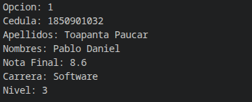

**Búsqueda de estudiante por cédula:**
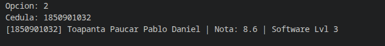

### Recorridos del Árbol
**Recorrido Inorden (Orden ascendente por cédula):**
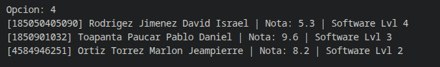

**Recorrido Preorden:**
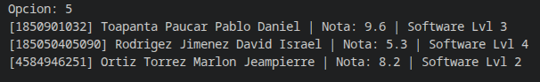

**Recorrido Postorden:**
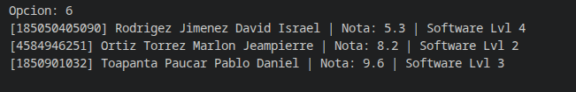

**Recorrido por Niveles (BFS):**
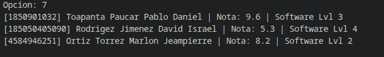

### Métricas y Estadísticas
**Cálculo de la altura del árbol:**
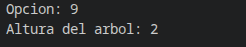

**Conteo total de registros:**

### Reportes Académicos
**Estudiante con el mejor rendimiento (Nota Mayor):**
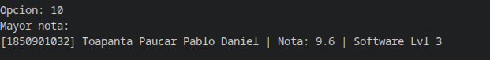

**Estudiante con el menor rendimiento (Nota Menor):**
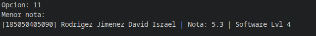

**Listado de estudiantes aprobados:**
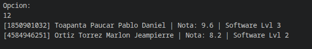

**Listado de estudiantes reprobados:**
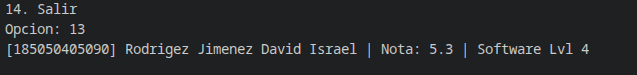

---

### Commits Generados

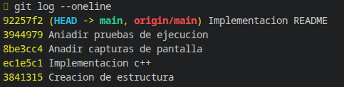

## 6. Conclusiones
La implementación exitosa de este sistema demuestra la versatilidad de los Árboles Binarios de Búsqueda para el manejo de información jerárquica y ordenada.